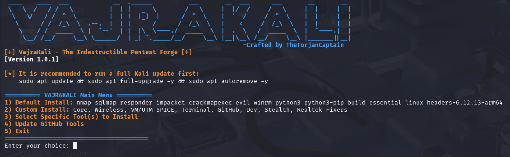

# VajraKali - The Indestructible Pentest Forge




## ⚡ About VajraKali

**VajraKali** is a customizable, beginner-friendly Kali Linux pentesting setup tool designed to automate and simplify the process of setting up your hacking lab. It covers installation of core, wireless, VM, terminal, development, stealth, and Realtek-specific tools — along with popular GitHub-based utilities like PEASS-ng and Gowitness.

---

## ✨ Features

- ✅ Default, Custom, or Specific Tool Installation Modes.
- ✅ Automatic detection of already installed APT tools.
- ✅ GitHub tools clone & setup (`linpeas`, `winpeas`, `wpscan`, `gowitness`).
- ✅ Post-install summary (Installed / Failed tools).

---

## 📋 Usage

```bash
git clone https://github.com/TheTorjanCaptain/VAJRAKALI.git
cd VAJRAKALI
chmod +x VAJRAKALI.sh
sudo ./VAJRAKALI.sh

⚠️ Always run this as root/sudo to avoid permission errors.


⚙️ Available Tool Modules
Core Tools – nmap, sqlmap, responder, impacket, crackmapexec, evil-winrm, etc.
Wireless Tools – aircrack-ng, reaver, pixiewps, bully
VM/UTM Tools – spice-vdagent, qemu-guest-agent
Terminal Tools – neofetch, htop, tmux, zsh
GitHub Tools – linpeas, winpeas, wpscan, gowitness
Developer Essentials – git, curl, wget, vim, golang
Stealth Tools – tor, proxychains, macchanger
Realtek Fixers – rtl88xxau, rtl8812au drivers


💡 Roadmap
✅ Interactive menu-driven installation
✅ Ctrl+C graceful exit handling
❌ Smart GitHub tool detection & update check (Planned)
❌ Auto-detection of missing dependencies (Planned)
❌ Package conflict resolution warning (Planned)


⚠️ Disclaimer
⚠️ This tool is intended only for authorized security testing and educational purposes.
Misuse of this tool for unauthorized attacks is strictly prohibited.

📄 License
This project is licensed under the MIT License.


🤖 **Author**

