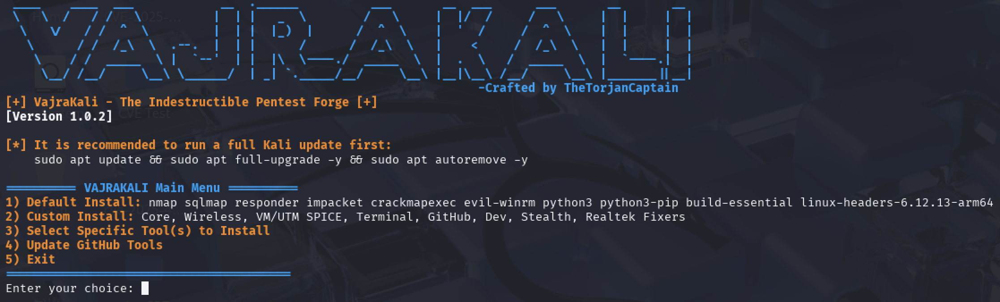

# VajraKali - The Indestructible Pentest Forge




## ⚡ About VajraKali

**VajraKali** is a customizable, beginner-friendly Kali Linux pentesting setup tool designed to automate and simplify the process of setting up your hacking lab. It covers installation of core, wireless, VM, terminal, development, stealth, and Realtek-specific tools — along with popular GitHub-based utilities like PEASS-ng and Gowitness.

---

## ✨ Features

- ✅ Default, Custom, or Specific Tool Installation Modes.
- ✅ Automatic detection of already installed APT tools.
- ✅ GitHub tools clone & setup (`linpeas`, `winpeas`, `wpscan`, `gowitness`).
- ✅ Automatic installation of tool dependencies for Python and Go projects.
- ✅ Manual but automated GitHub tool update functionality with success/error reporting.
- ✅ Optional weekly cron job setup for automatic GitHub tools updates.
- ✅ Post-install summary showing Installed and Failed tools.

---

## 📋 Usage

```bash
git clone https://github.com/TheTorjanCaptain/VAJRAKALI.git
cd VAJRAKALI
chmod +x VAJRAKALI.sh
sudo ./VAJRAKALI.sh
```
⚠️ Always run this as root/sudo to avoid permission errors.

---

## ⚙️ Available Tool Modules
- **Core Tools** – nmap, sqlmap, responder, impacket, crackmapexec, evil-winrm, etc.
- **Wireless Tools** – aircrack-ng, reaver, pixiewps, bully
- **VM/UTM Tools** – spice-vdagent, qemu-guest-agent
- **Terminal Tools** – neofetch, htop, tmux, zsh
- **GitHub Tools** – linpeas, winpeas, wpscan, gowitness
- **Developer Essentials** – git, curl, wget, vim, golang
- **Stealth Tools** – tor, proxychains, macchanger
- **Realtek Fixers** – rtl88xxau, rtl8812au drivers

---

## 🕒 Automatic Updates & Cron Jobs

After running updates, VajraKali can prompt you to install a **weekly scheduled cron job** that automatically updates the GitHub-based tools for you, helping keep your pentesting environment continuously up-to-date without manual intervention.

---

## 💡 Roadmap
✅ Interactive menu-driven installation  
✅ Ctrl+C graceful exit handling  
✅ Smart GitHub tool detection & update check  
✅ Auto-detection of missing dependencies  
✅ Package conflict resolution warning  
❌ Facts on VAJRAKALI (Planned)

---

## ⚠️ Disclaimer
⚠️ This tool is intended only for authorized security testing and educational purposes.
Misuse of this tool for unauthorized attacks is strictly prohibited.

---

## 📄 License
This project is licensed under the MIT License.

---

## 🤝 Wanna Contribute? Bring the Chaos (Nicely)!

Found a bug? Got a shiny new feature idea? Or just want to make this script even cooler?
Awesome. You’re totally welcome here. Here’s how to break (uhh… improve) things the right way:
1. 🍴 **Fork this repo** — it’s free, I promise.  
2. 🔀 Create a new branch — `git checkout -b cool-feature`  
3. ✍️ Make your magical changes — add stuff, break stuff, fix stuff (preferably fix).  
4. 🚀 Push your branch — `git push origin cool-feature`  
5. 🎉 Open a **Pull Request** — and bask in eternal open-source glory.

---

### 🧠 Got ideas but lazy to code?

No problem! Just [open an issue](https://github.com/TheTorjanCaptain/VAJRAKALI/issues) and dump your genius there. I’ll read it. Maybe even reply. 😉

---

### 🚨 Some "Rules" (Because Life Needs 'Em)

- Don’t break the main script unless you’re fixing it better.  
- Keep the style clean like your browser history (or cleaner).  
- Big changes? Open an issue and let’s discuss like civil hackers.

---

## 🤖 Author
[TheTorjanCaptain](https://github.com/TheTorjanCaptain)
